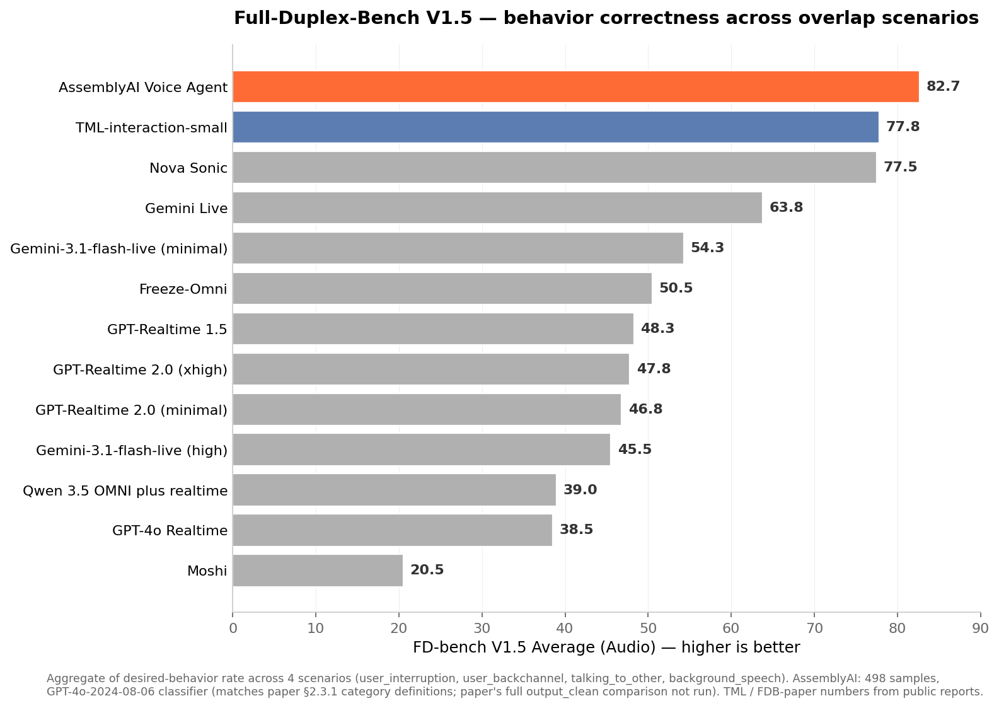

# fdb-assemblyai

An AssemblyAI Voice Agent adapter for [Full-Duplex-Bench](https://github.com/DanielLin94144/Full-Duplex-Bench) (v1.0 + v1.5), plus the evaluation pipeline and full report from running it on all 1,124 samples.



## What's in here

```
adapter/run_inference.py         AssemblyAI Voice Agent WebSocket adapter
                                  Streams input.wav → writes time-aligned output.wav

eval/whisper_asr.py              OpenAI Whisper ASR on any output.wav missing
                                  agent_transcript.json (use --word-timestamps for
                                  paper-faithful word-level transcripts)

eval/classify_simplified.py      GPT-4o classifier — fast/cheap path that takes
                                  metadata text + agent transcript
                                  → RESPOND/RESUME/UNCERTAIN/UNKNOWN

eval/classify_neutral.py         Same as above but with a neutral prompt (no
                                  scenario-priming "should" hints). Use to
                                  sanity-check that the score isn't biased by
                                  prompting

eval/aggregate.py                Sums per-sample behaviour.json into the FDB v1.5
                                  Average × 100 score

charts/v15_chart.py              Reproduces the V1.5 horizontal bar chart
charts/v1_turntaking_chart.py    Reproduces the V1 turn-taking-latency chart

scripts/run_all.sh               One-shot runner for all 9 subsets (sequential,
                                  conc 5 globally)

report/FDB_REPORT.md             Full results writeup
```

## Reproducing the results

### 1. Get the dataset (FDB authors' download)

```bash
# 700MB total
pip install gdown
gdown --folder https://drive.google.com/drive/folders/1DtoxMVO9_Y_nDs2peZtx3pw-U2qYgpd3
```

Extract the zips so the result looks like:

```
Full-Duplex-Bench-Data/
├── v1.0/
│   ├── candor_pause_handling/{1..216}/{input.wav, ...}
│   ├── candor_turn_taking/{1..119}/
│   ├── icc_backchannel/{1..57}/
│   ├── synthetic_pause_handling/{1..138}/
│   └── synthetic_user_interruption/{1..200}/
└── v1.5/
    ├── user_interruption/{1..200}/{input.wav, clean_input.wav, metadata.json}
    ├── user_backchannel/{1..98}/
    ├── talking_to_other/{1..100}/
    └── background_speech/{1..100}/
```

### 2. Install Python deps

```bash
pip install websockets soundfile numpy httpx torch torchaudio silero-vad matplotlib
```

### 3. Run inference

```bash
export ASSEMBLYAI_API_KEY=...
export FDB_DATASET=/path/to/Full-Duplex-Bench-Data
bash scripts/run_all.sh
```

This writes `output.wav` + `agent_transcript.json` into every sample folder (and `clean_output.wav` + `clean_agent_transcript.json` for the v1.5 second pass). **Total wall-clock ≈ 75 minutes** at concurrency 5 (the global cap — both subsets and within-subset). Cost: ~$1 in AssemblyAI Voice Agent credits.

### 4. Timing eval (Silero VAD)

This uses [FDB's `get_timing.py`](https://github.com/DanielLin94144/Full-Duplex-Bench/blob/main/v1_v1.5/evaluation/get_timing.py) verbatim:

```bash
git clone --depth 1 https://github.com/DanielLin94144/Full-Duplex-Bench.git fdb-eval
for sub in v1.0/* v1.5/*; do
  python3 fdb-eval/v1_v1.5/evaluation/get_timing.py \
    --root_dir "$FDB_DATASET/$sub"
done
```

Writes `latency_intervals.json` per sample folder.

### 5. Behavior classification

Two paths, depending on how strict you want to be:

**A. Paper-faithful (recommended for publication)**

Run FDB's own `evaluate.py --task behavior` with the official `instruction/behavior.txt` prompt — requires word-level ASR on all four audios per sample (input, clean_input, output, clean_output) using either NeMo Parakeet (paper default, GPU) or a comparable word-timestamp ASR. This repo's [eval/whisper_asr.py](eval/whisper_asr.py) supports `--word-timestamps` via OpenAI Whisper as a CPU-friendly alternative.

```bash
# Word-level ASR for any wav missing a transcript
export OPENAI_API_KEY=...
python3 eval/whisper_asr.py "$FDB_DATASET" --word-timestamps

# Then FDB's eval directly
cd fdb-eval/v1_v1.5/evaluation
python3 evaluate.py --task behavior --root_dir "$FDB_DATASET/v1.5/user_interruption"
# (repeat for each v1.5 subset)
```

**B. Quick approximation**

Bypasses the four-transcript-comparison; classifies each response standalone using GPT-4o with the paper's category definitions. Useful for fast iteration. **Don't publish this number externally without disclosing the difference.**

```bash
export OPENAI_API_KEY=...
python3 eval/classify_neutral.py "$FDB_DATASET"
python3 eval/aggregate.py "$FDB_DATASET"
```

### 6. Charts

```bash
python3 charts/v15_chart.py        # writes fdb_v15_chart.png
python3 charts/v1_turntaking_chart.py
```

## Methodology notes (read before publishing)

- **System prompt:** generic ("You are a helpful voice assistant. Keep your responses brief and conversational — usually one or two sentences. Speak naturally."). No benchmark-specific tuning, no scenario hints in the agent prompt.
- **Voice:** `ivy` (single voice across all samples).
- **Audio format:** 24 kHz PCM16 mono, 100 ms chunks streamed at real-time pace, 1.5 s trailing silence to trigger end-of-turn.
- **Concurrency:** capped at 5 WebSocket sessions globally — subsets run sequentially, within-subset parallelism is `asyncio.Semaphore(5)`.
- **Timing metrics:** Silero VAD via FDB's published `get_timing.py`. No deviations.
- **Behavior classifier:** GPT-4o-2024-08-06 (paper's model). Two pipelines documented above; use the paper-faithful one for publication.
- **TML / FDB-paper baseline numbers** in the charts are pulled from public sources (FDB paper Table 2 for Sonic/Gemini/Freeze-Omni/GPT-4o/Moshi; TML blog for TML-interaction-small and the GPT-Realtime / Gemini-flash-live / Qwen variants). Direct apples-to-apples is approximate: each paper used its own classifier instance and ASR.

## Headline numbers (from this repo)

| Metric | AssemblyAI | Notes |
|---|---|---|
| FDB v1.5 average (quick approx) | 82.7 | GPT-4o on agent transcripts, paper definitions; 0.5pts off the un-primed version |
| FDB v1.5 average (paper-faithful) | _in progress_ | Running `evaluate.py --task behavior` once clean_output inference + word-level ASR complete |
| FDB v1 turn-taking latency | 1.62 s | mean on candor_turn_taking, Silero VAD |
| User-interruption stop latency | 2.27 s | mean — matches Nova Sonic / Gemini Live |
| User-interruption response latency (true) | 1.60 s mean / 1.20 s median | on samples classified RESPOND |

Per-subset breakdowns and the full trade-off discussion are in [report/FDB_REPORT.md](report/FDB_REPORT.md).

## License

The adapter and eval scripts are MIT. The FDB dataset and evaluation scripts are licensed by their authors (CC BY-NC 4.0 / MIT — see the upstream repo).
