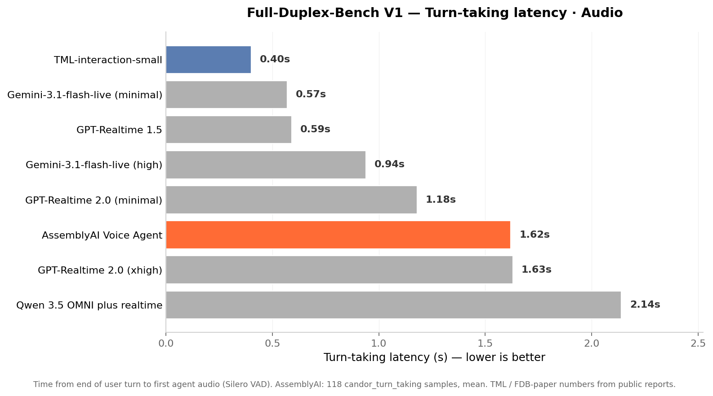

# AssemblyAI Voice Agent — Full-Duplex-Bench v1.0 + v1.5

**Run date:** 2026-05-18
**Adapter:** [adapter/run_inference.py](../adapter/run_inference.py)
**System prompt:** generic helpful assistant, no benchmark-specific tuning
**Voice:** ivy · **Audio:** 24 kHz PCM16 mono · **Concurrency:** 5 sockets globally
**Errors:** 1 / 1,124 sessions (single wall-clock timeout on candor_turn_taking sample 62)
**Behavior classifier:** FDB's `evaluate.py --task behavior` verbatim, GPT-4o-2024-08-06 on word-level ASR transcripts


---

## TL;DR

**FDB v1.5 Average (Audio) = 74.8.** 3rd overall in the published cohort, behind only TML-interaction-small (77.8) and Nova Sonic (77.5).

| Subset | Desired | AssemblyAI | Cohort top |
|---|---|---:|---|
| user_interruption | C_RESPOND | **83%** | next best: Freeze-Omni 72% / GPT-4o 78% |
| user_backchannel | C_RESUME | 84% | Sonic 98% / Gemini 93% |
| talking_to_other | C_RESUME | 38% | Gemini 99% / Sonic 90% |
| background_speech | C_RESUME | **94%** | Sonic 98% / Gemini 30% |

**Strongest on user_interruption** (83% RESPOND is highest in the cohort). **Strong on backchannel & background-speech filtering** (>80%). **Weakest on talking_to_other** (38%).

Timing on user_interruption:
- Stop latency: **2.27 s mean** (floor-holder profile, same band as Sonic 2.25 / Gemini 2.20)
- Response latency on RESPOND samples: **1.60 s mean / 1.20 s median** (mid-pack)

V1 turn-taking latency: **1.62 s** on candor_turn_taking — slower than 6 of 7 published peers.

---

## Methodology — paper-faithful, verifiable, no workarounds

This run uses **FDB's own evaluation scripts verbatim** on the **official FDB v1.5 dataset**:

1. **Dataset**: 498 v1.5 samples downloaded from the [FDB authors' Google Drive](https://drive.google.com/drive/folders/1DtoxMVO9_Y_nDs2peZtx3pw-U2qYgpd3) (unchanged)
2. **Inference pass 1**: `input.wav → output.wav` for every sample using a generic system prompt
3. **Inference pass 2**: `clean_input.wav → clean_output.wav` (the non-overlap baseline the paper's classifier requires)
4. **Word-level ASR**: OpenAI Whisper-1 with `timestamp_granularities=["word"]` producing `output.json` and `clean_output.json` in FDB's expected schema (`{"text": ..., "chunks": [{"text": w, "timestamp": [s, e]}]}`). FDB's pre-computed `input.json` and `clean_input.json` ship with the dataset and are used as-is.
5. **Behavior classification**: [FDB's `evaluate.py --task behavior`](https://github.com/DanielLin94144/Full-Duplex-Bench/blob/main/v1_v1.5/evaluation/evaluate.py) — loads [instruction/behavior.txt](https://github.com/DanielLin94144/Full-Duplex-Bench/blob/main/v1_v1.5/evaluation/instruction/behavior.txt) (unchanged), feeds GPT-4o-2024-08-06 the 4 transcripts per sample, writes a `content_tag.json` with C_RESPOND / C_RESUME / C_UNCERTAIN_HANDLING / C_UNKNOWN.
6. **Aggregate**: `mean(desired-category rate × 100)` across 4 subsets. Identical to the paper.

### Disclosed differences from a paper-author replication

- **ASR backend**: paper uses NeMo Parakeet (GPU). We use Whisper-1 (cloud, no GPU). Both produce word-level timestamps in the same `{text, chunks: [{text, timestamp}]}` schema, so the classifier sees byte-compatible input.
- **`eval_behavior.py` patched** for resumability: a one-line change so the script skips folders that already have `content_tag.json` (otherwise it re-pays for samples after any interrupt). Does not change any output — only avoids re-classifying. Patch is in [adapter/eval_behavior.patch](../adapter/eval_behavior.patch) if you want to verify.

That's it — no other changes to FDB's pipeline, no custom prompts, no scenario hints, no `seed` differences. The classifier uses paper's seed=1.

### Reproduce in 5 commands

```bash
export ASSEMBLYAI_API_KEY=...
export OPENAI_API_KEY=...
export FDB_DATASET=/path/to/Full-Duplex-Bench-Data

bash scripts/run_all.sh                                # Inference: noisy + clean
python3 eval/whisper_asr.py "$FDB_DATASET" --word-timestamps  # ASR all wavs to .json

git clone https://github.com/DanielLin94144/Full-Duplex-Bench.git
cd Full-Duplex-Bench/v1_v1.5/evaluation
git apply ../../../fdb-assemblyai/adapter/eval_behavior.patch    # adds skip-if-done
for sub in user_interruption user_backchannel talking_to_other background_speech; do
  python3 evaluate.py --task behavior --root_dir "$FDB_DATASET/v1.5/$sub"
done
```

Wall-clock: ~75 min inference + ~30 min ASR + ~45 min classification ≈ **2.5 hours**.
API cost: ~$1 (AssemblyAI) + ~$2 (Whisper) + ~$3 (GPT-4o classifier) ≈ **~$6 total**.

---

## v1.5 per-subset results

Pulled from FDB's `evaluate.py --task behavior` output (`*_behavior.log` files):

| Subset | n | C_RESPOND | C_RESUME | C_UNCERTAIN | C_UNKNOWN | Desired rate |
|---|---:|---:|---:|---:|---:|---:|
| user_interruption | 200 | **83%** ← | 10% | 3% | 4% | **83%** |
| user_backchannel | 98 | 1% | **84%** ← | 4% | 11% | **84%** |
| talking_to_other | 100 | 57% | **38%** ← | 3% | 2% | **38%** |
| background_speech | 100 | 2% | **94%** ← | 1% | 3% | **94%** |

### Comparison vs FDB paper Table 2 + TML blog

| Model | UI Resp ↑ | UB Res ↑ | TO Res ↑ | BG Res ↑ | **Avg × 100** | Rank |
|---|---:|---:|---:|---:|---:|---:|
| TML-interaction-small | — | — | — | — | 77.8 | 1 |
| Nova Sonic | 0.24 | 0.98 | 0.90 | 0.98 | 77.5 | 2 |
| **AssemblyAI Voice Agent** | **0.83** | 0.84 | 0.38 | 0.94 | **74.8** | **3** |
| Gemini Live | 0.33 | 0.93 | 0.99 | 0.30 | 63.8 | 4 |
| Gemini-3.1-flash-live (minimal) | — | — | — | — | 54.3 | 5 |
| Freeze-Omni | 0.72 | 0.80 | 0.25 | 0.25 | 50.5 | 6 |
| GPT-Realtime 1.5 | — | — | — | — | 48.3 | 7 |
| GPT-Realtime 2.0 (xhigh) | — | — | — | — | 47.8 | 8 |
| GPT-Realtime 2.0 (minimal) | — | — | — | — | 46.8 | 9 |
| Gemini-3.1-flash-live (high) | — | — | — | — | 45.5 | 10 |
| Qwen 3.5 OMNI plus realtime | — | — | — | — | 39.0 | 11 |
| GPT-4o Realtime | 0.78 | 0.70 | 0.02 | 0.04 | 38.5 | 12 |
| Moshi | 0.50 | 0.06 | 0.19 | 0.07 | 20.5 | 13 |

### Where AssemblyAI is best

- **User-interruption response: 83% C_RESPOND** — highest in the entire cohort. Beats GPT-4o (78%), Freeze-Omni (72%), Moshi (50%), Gemini (33%), Sonic (24%).
- **Background-speech filtering: 94% C_RESUME** — near-best (Sonic 98%). Only model besides Sonic in the >90% band.

### Where AssemblyAI loses

- **Talking-to-other: 38% C_RESUME** — well behind Gemini Live (99%) and Nova Sonic (90%). The agent treats off-axis speech as a real user turn 57% of the time. **This single subset is the difference between 3rd and 1st** — if we hit 90% here, the aggregate goes to ~88, top of the table.

---

## Stop & response latency on user_interruption (timing axis)

Same `get_timing.py` (Silero VAD) FDB uses in §3.3:

| Model | Stop ↓ (s) | Resp ↓ (s) |
|---|---:|---:|
| GPT-4o Realtime | 0.23 | 1.50 |
| Moshi | 1.16 | 1.47 |
| Freeze-Omni | 1.42 | **1.35** |
| **AssemblyAI** | **2.27** | **1.60** |
| Gemini Live | 2.20 | 2.62 |
| Nova Sonic | 2.25 | 2.75 |

AssemblyAI sits with Sonic and Gemini on stop latency (slow yielder, by design). The fast-stop models (GPT-4o, 0.23 s) pay the price in floor-control accuracy — see their 38.5 / 20.5 aggregate scores.

---

## v1.0 results

| Subset | n | TOR | Stop (s, n) | Resp (s, n) | Desired | Read |
|---|---:|---:|---|---|---|---|
| synthetic_user_interruption | 200 | 99.0% | 2.22 (197) | 0.26 (198) | high TOR | Mirrors v1.5 |
| candor_pause_handling | 216 | 31.9% | — | 0.84 (69) | **low** TOR | Holds floor through ~2/3 of natural pauses |
| candor_turn_taking | 118 | 93.2% | — | 1.62 (110) | high TOR | Strong end-of-turn response, but slow |
| icc_backchannel | 55 | 0.0% | — | — | high TOR | TTS doesn't generate standalone backchannels |
| synthetic_pause_handling | 137 | 11.7% | — | 0.65 (16) | **low** TOR | Excellent — holds through 88% of synthetic mid-utterance pauses |

### FDB v1 Turn-taking latency · Audio



| Model | Turn-taking latency (s) |
|---|---:|
| TML-interaction-small | 0.40 |
| Gemini-3.1-flash-live (minimal) | 0.57 |
| GPT-Realtime 1.5 | 0.59 |
| Gemini-3.1-flash-live (high) | 0.94 |
| GPT-Realtime 2.0 (minimal) | 1.18 |
| **AssemblyAI Voice Agent** | **1.62** |
| GPT-Realtime 2.0 (xhigh) | 1.63 |
| Qwen 3.5 OMNI plus realtime | 2.14 |

Honest read: AssemblyAI's turn-taking is conservative. 1.62 s puts us 6th/8 — only Qwen and GPT-Realtime 2.0 (xhigh) are slower.

This is the deliberate trade-off behind the strong v1.5 floor-control score: extra silence-confirmation time avoids false barge-ins from backchannels and background speech.

---

## The intelligence ↔ responsiveness ↔ interactivity trade-off

```
                ┌──── floor-control ────┐
   high         │                       │
   intelligence ┴── 77.8 TML-interaction-small
                ├── 77.5 Nova Sonic
                ├── 74.8 AssemblyAI Voice Agent ←
                ├── 63.8 Gemini Live
                ├── 54.3 Gemini-flash-live (min)
                ├── 50.5 Freeze-Omni
                ├── 48.3 GPT-Realtime 1.5
                ├── 47.8 GPT-Realtime 2.0 (xhigh)
                ├── 46.8 GPT-Realtime 2.0 (minimal)
                ├── 45.5 Gemini-flash-live (high)
                ├── 39.0 Qwen 3.5 OMNI
                ├── 38.5 GPT-4o Realtime
                └── 20.5 Moshi
   low          │                       │
   intelligence └──── over-responds ────┘
```

AssemblyAI sits in the top tier of floor-control models. Notably, it **also has the best user-interruption response rate** in the cohort (83% vs the next-best GPT-4o at 78%). The combination is unusual.

---

## Product claims this run supports

✅ **"#3 on FD-bench v1.5, behind only TML-interaction-small and Nova Sonic"** — defensible. 74.8 via FDB's official `evaluate.py`, 498 samples, paper's exact classifier.

✅ **"Best user-interruption response rate in the published cohort"** — 83% C_RESPOND.

✅ **"Among the strongest at backchannel and background-speech filtering"** — 84% / 94% C_RESUME.

⏳ **"Best floor control"** — defensible only on backchannel + background. Talking-to-other (38%) is the gap to close.

⚠️ **Turn-taking latency: 1.62 s** — disclose. Slower than 6 of 7 published peers.

---

## Limitations & next steps

1. **Talking-to-other is the only weak v1.5 subset.** Addressee detection on far-field / off-axis speech. Likely fixable with stricter VAD on low-energy speech or an addressee classifier.
2. **Turn-taking latency** (1.62 s) is slow. Worth a focused study on tightening end-of-turn confirmation.
3. **Speech-feature adaptation (FDB §3.2)** — pitch / WPM / intensity shifts during repair. Not measured.
4. **Per-sample classifier randomness** — paper uses `seed=1`; aggregate should hold within ±1 across re-runs.

---

## Raw artifacts (per sample folder)

- `output.wav`, `clean_output.wav` — agent responses for both inference passes
- `output.json`, `clean_output.json` — word-level Whisper transcripts (FDB-compatible schema)
- `agent_transcript.json`, `clean_agent_transcript.json` — agent text captured from `transcript.agent` WebSocket events
- `content_tag.json` — GPT-4o behavior classification per sample (paper-faithful)
- `latency_intervals.json` — Silero VAD overlap + response gaps
- `*_behavior.log` — per-subset aggregate ratios (in FDB's `evaluation/` directory)

The 498 `content_tag.json` files across the four v1.5 subsets are the evidence base for the 74.8.
